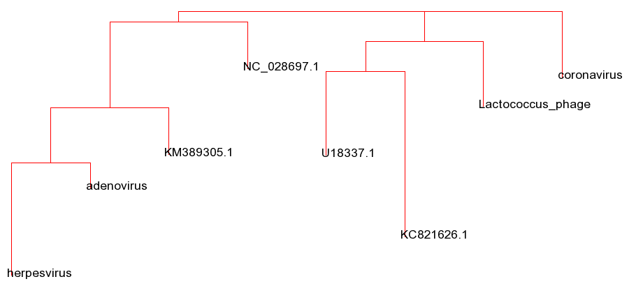
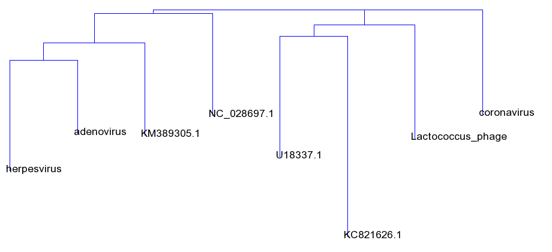

---
title: 1 laboratorinis darbas
author: Armintas Pakenis
affiliation: Vilniaus universitetas
email: armintas.pakenis@mif.stud.vu.lt
date: 2022-10-13
abstract: Kodonų ir dikodonų dažnių įvertinimas žinduolių, bakterijų virusuose.
lang: lt
...

# Įžanga

Python kalba parašytoje programoje įvestis buvo 4 žinduolių virusų ir 4 bakterijų virusų sekos, nuskaitytos iš failų .fasta formatu. Rezultatui interpretacijai buvo pasitelgti 2 filogenetiniai medžiai (naudojant *neighbor joining* klasterizavimo metodą) sudaryti iš gautų programos rezultatų - t. y. atstumo matricų.

# Metodologija
Buvo naudojama standartinė kodonų kodavimo lentelė: *starto* kodonas ATG, *stop* kodonai - TAA, TAG, TGA.

Tiek *forward*, tiek *reverse-complement* grandims buvo išrinkti ORF'ai. Iš jų skaičiuoti kodonų ir dikodonų pasitaikymai.

Į kodonų dažnių skaičiavimą nebuvo įtraukiami *stop* kodonai.
Kodonų dažniai skaičiuojami buvo per visus ORF'us bendrai, normalizuojant dažnį: kodono pasikartojimo skaičius 1000 (tūkstančiui) kodonų. Analogija sekė su dikodonų dažnių skaičiavimu.

Atstumų matrica buvo sudarant naudojant bendrą Euklido atstumo formulę:
$$
    \sqrt{\sum_{i = 0}^n(x_i - y_i)^2},
$$
kur $x_i, y_i$ žymi skirtingų virusų sekų $i$-tajo kodono ar dikodono dažnį iš dažnių rinkinio $x$ ar $y$.

# Rezultatai
Vienas bakterinis virusas klasterizavosi kartu su kitais 3 žinduoliniais virusais.
Vienas žinduolinis virusas klazterizavosi kartu su kitais 2 bakteriniais virusais. 

Koronavirusas buvo išskirtinis, nes jis klasterizavosi vienas.

Dikodonų ir kodonų dažniai skiriasi, tačiau esant dideliam galimų dikodonų skačiui ($4^6$), dažniai tampa sąlyginai maži ir atstumų matricoje atstumai tarp sekų yra mažesni naudojant minėtą metodologiją.

